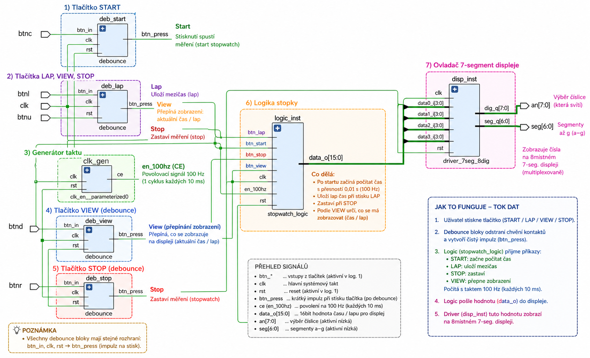
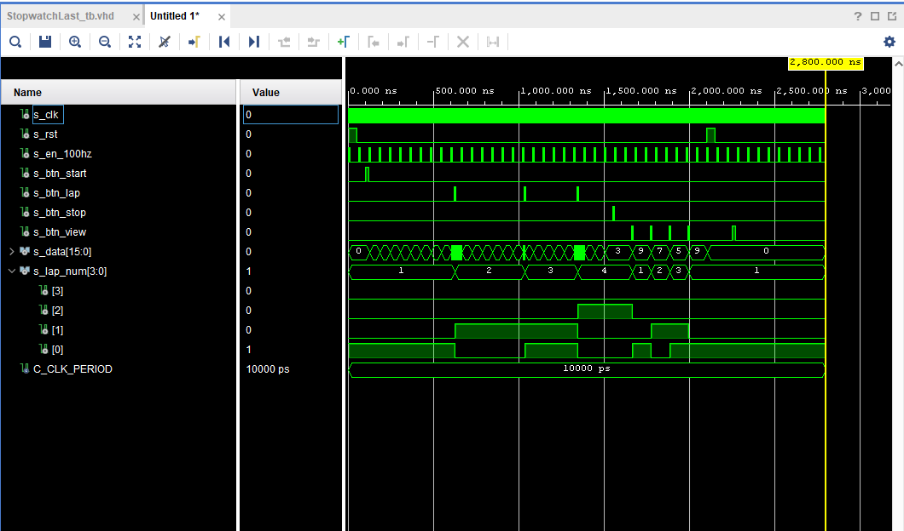

# Stopwatch_projekt

Tento projekt implementuje pokročilé digitální stopky s funkcí měření kol (Lap) a historií měření na vývojové desce Nexys A7-50T. Systém je navržen v jazyce VHDL

Hlavní funkce
Měření času: Přesnost na setiny sekundy s maximálním rozsahem 99:99.

Měření kol (Lap): Možnost změřit aktuální čas kola, který se uloží do vnitřní paměti, přičemž běžící časomíra se pro nové kolo automaticky vynuluje.

Historie měření: Možnost procházet až 8 naposledy uložených časů kol.

Odkaz na video: [Video](https://youtu.be/4Q61KutTz-0)

Odkaz na projekt: [Projekt](DE1_ProjektFinal)

Odkaz na plakat: [Plakat](DE1_plakat.png)

## Ovládání 
K ovládání stopek se využívá 5 tlačítek v křížovém uspořádání na desce Nexys A7:
Tlačítko	Funkce	Popis
+ BTNC (Střed)	START	Spustí hlavní časomíru.
+ BTNL (Vlevo)	ZMĚŘENÍ ČASU	Uloží čas aktuálního kola do historie a vyresetuje čítač pro nové kolo.
+ BTNR (Vpravo)	KONEC	Zastaví běžící časomíru.
+ BTND (Dole)	KONTROLA	Přepne do režimu historie a listuje mezi uloženými časy kol.
+ BTNU (Nahoře)	RESET	
Globální synchronní reset: vynuluje čas a kompletně vymaže paměť kol.

## Blokové schéma
Blokové schéma vygenerované Vivadem z poslední iterace projektu. Doplněné popisem jednotlivých bloků.

## Popis simulace
Na obrázku můžeme vidět simulaci, kterou jsme získali ve Vivadu. Zkoušíme simulovat, jestli náš koncept funguje. Kod simulace je [zde](DE1_ProjektFinal/DE1_ProjektFinal.srcs/sim_1/new/StopwatchLast_tb.vhd).
+ s_clk a s_en_100hz: Ukazka časovače a pruběh měření.
+ s_rst: Tlačitko na restart měření, po zmáčknutí se vymažou data.
+ s_btn_start: Tlačítko na start měření, po zmačknutí připravuji uložistě pro data.
+ s_btn_lap: Tlačitko pro změření kola, po zmačknutí se uloží data.
+ s_btn_stop: Tlačitko pro ukončení měření, po zmáčknutí se ukončí měření.
+ s_btn_view: Tlačítko pro ukazku změřených časů, po zmačknutí se postupně zobrazují jednotlivá naměřená kola.
+ s_data a s_lap_num: Ukazka počtku kola a uložených dat.
  

## Využité součástky 
+ Segmentový display
+ Anodu pro desetinou tečku
+ Anody pro zobrazování času
+ Tlačítka

## Využité meterialy
+ V hodinách vytvořené kódy
+ Github pana docenta: [Git](https://github.com/tomas-fryza/vhdl-examples)
+ Kolegové
+ Umělá inteligence
+ Testbench: [Testbench](https://vhdl.lapinoo.net)

